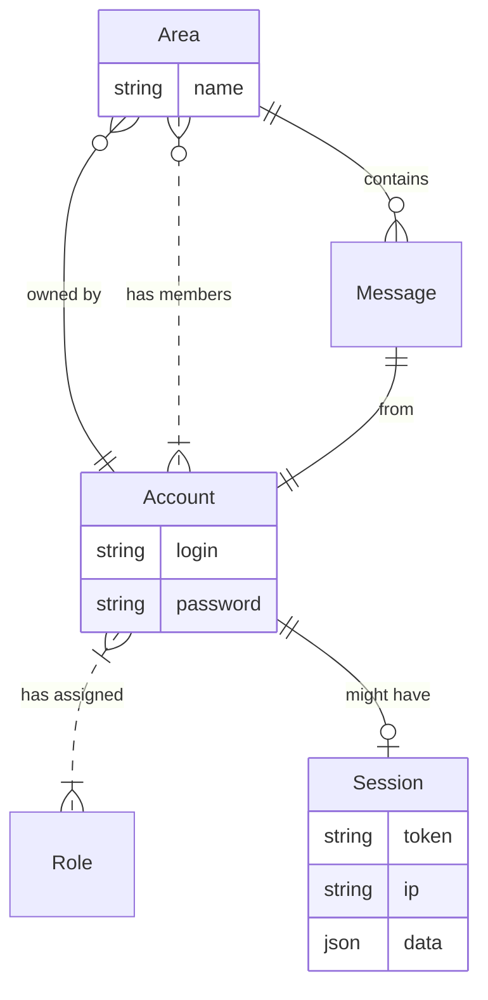
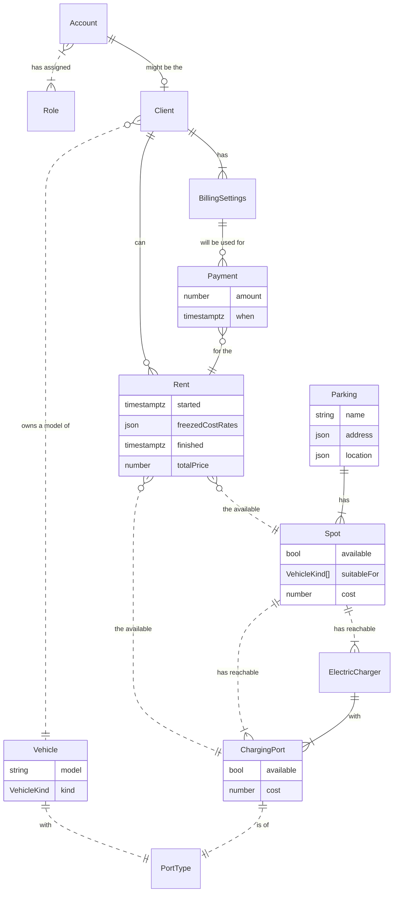
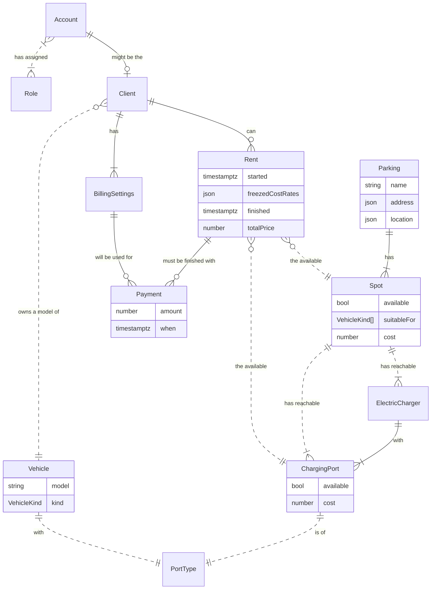

# Metatech University. NodeJS 2022 Homework. Tasks #2

## Messenger domain

## Selected custom domain: EV Parking
Parking network for electric vehicles with warranty of available electric charger on the spot.

#### Alternative declaration for the Rent -- Payment relation:
(semantic difference that visualized by Mermaid's diagram logic)

