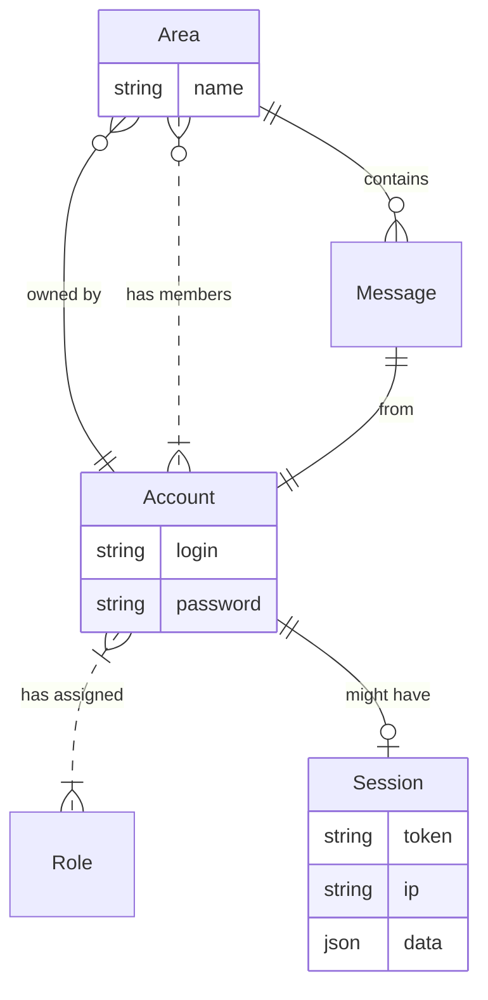
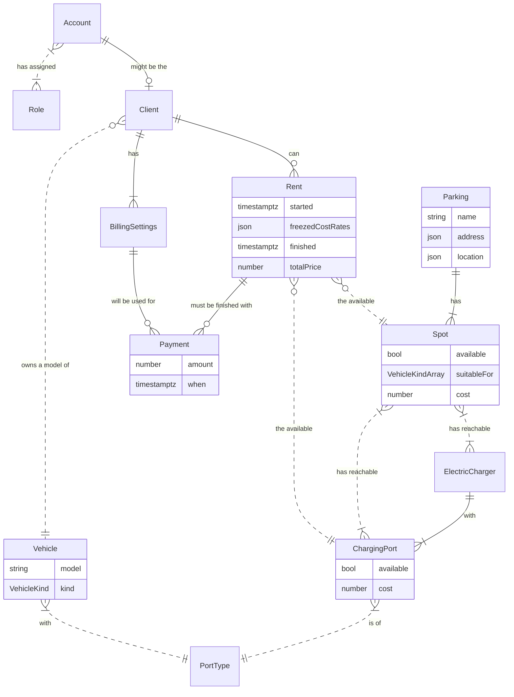
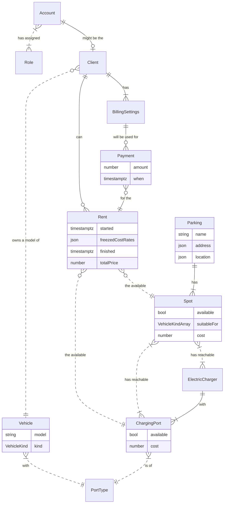

# Metatech University. NodeJS 2022 Homework. Tasks #2

## Messenger domain

## Selected custom domain: EV Parking
Parking network for electric vehicles with warranty of available electric charger on the spot.

If the diagram not renders you may watch it on the [Mermaid.live](https://mermaid.live/edit#pako:eNp9VMuOGjEQ_BXLZxaFRNqs5rYhm0sUCUGUQ8SlGTeMN34g2xMCM_x72h7DmkciDiPbVdXdVcYdr61AXnF0nyVsHOilYey5rm1rAjv243HfsblVyCq25A14Bt7LjUGx5CWy7x8ebM-mSiKtIlbLTRPYCllocMDmwwgl0U9SKWk2CwyBPp44pF7AjpZq9-wHNrLO5e3OUH2mqWPF7HpQPQFSrz2bWRe-77eRsJOhWZqImReCi60dGqS-GPwGqWClcoclbtqA21BnUfBf-GIi2w3sitWQal7Pl0Ez2OuTRTuCRIdaj4KtrSuauIPWrU9-rqWRviFGmo8PE87A_aIyJ3PzkNnRtMpZviisg5N1Gg_dOVaHUDdvk5WUGyfu4K9lcx9X1CERdrl9G9ySS5_zLRPu4oIxT3Vo0nQLhp0M-CqNYOSCiLvH0pVLpgGNw8art4aBEA69L3aUrSFIa846yY0ssrJWFffguoFn52DPfCtDPP5CoSaEafWKbKmtD2fVCxf-o36Pmy5J5gSp0QfQ23CgEcEFFMUwa4d4QDEl9hwC-lvO6UJdVAs2gJpRoli4OVzG7gIIOj4At6q7BgcD-YhrdBqkoGcmcdN_iTLgMWpBGcWkIw7aYBd7U_MquBZHvN0Kajk_TLxag_K0uwXDq47_4dXk6f346ePj5MPj6Tfie169O474wVpiTEYchQzWfRteufTYJYWf6TyWOf4Fl8uyag)

### Alternative declaration for the Rent -- Payment relation:
(semantic difference that visualized by Mermaid's diagram logic)

If the diagram not renders you may watch it on the [Mermaid.live](https://mermaid.live/edit#pako:eNp9VF2P2jAQ_CuWnznEHfSul7crbV-qSgiqPlS8GHshbhMb2U4pJPnvXX-EM3AtUoSymZndnUncUq4F0IKC-SjZzrB6rQh54Vw3ypG-G4-7lix1BaQga1oyS5i1cqdArGmO7Lq7O92ReSUB7zy2lrvSkQ0QV0LEpoceiqIfZFVJtVuBc_hnkYPqGazX2Lsj36GUPLXXB4X9SY0TV0Rvo-oACLN2ZKGN-3bce8JBunKtPGaZCa72Og6IcxH2m8mKbao0YY6bl8zscDIv-C98tpFuI7sgnIWe1_sl0IId68GiA0K8Q40FQbbaRNEB0Wv0qYuqAY6IwcyIM79QefAz7ZVMDHcpvk8VcGckDxuBOSdpgPHydZmccrP8G_hr2TTHFTWGQC7Lt1mtqbQp0jzU1t8QYrEPbhqCj5UE-CKVIOiC8NU-d-WSqVgNsfDTakWYEAaszSqV5sxJrc46wY0kstG6yqK_HuDFGHYktpHOP_6MOQaEauoN2sK1dWfVCxf-o_4WN7wIieNkDdaxeu9OuCIzDkS2zNYAnEDMkb1kDuwtZyuVtOVASt2cdqxaYKKQuRnfxfYCyGr_zd-qHkqIBtIRrcHUTAo8WQI3fD6YAfVRC8zIJ-1xrHF6dVScFs40MKLNXuDI6SwainumaNHSP7SY3j-O8Xp4P51MJo-z6fOIHmkx6Uf0pDXiJ-Pn-Ht69zB7mk3vZyMKQjptvsZzLhx3QfFHIPgG_V8ES7A9)
