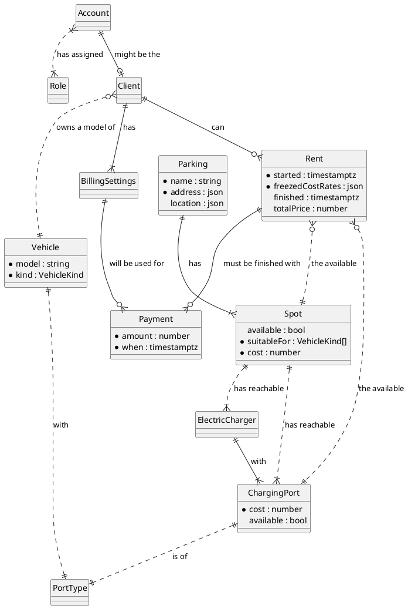
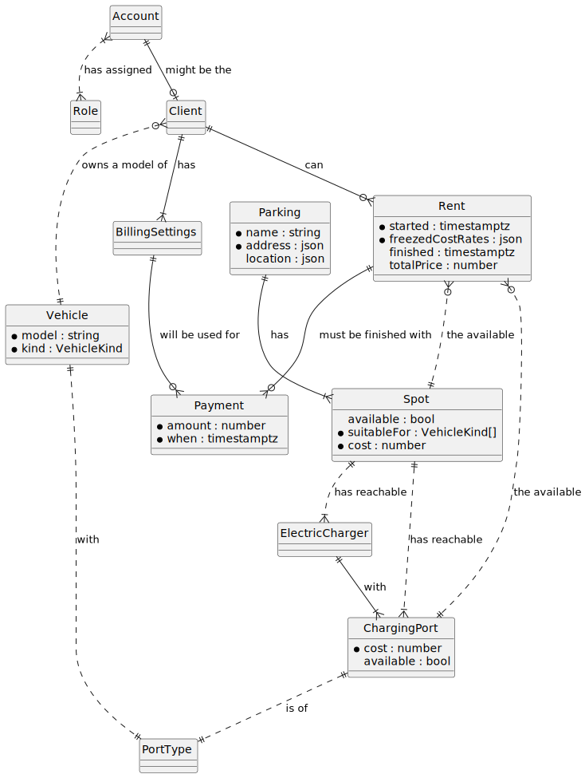

## Selected custom domain: EV Parking
Parking network for electric vehicles with warranty of available electric charger on the spot.

If the diagram not renders you may watch it on the [PlantUML.com online renderer](https://www.plantuml.com/plantuml/uml/RLCzSzim3DtvAt1QclGk-G6PqkRIfKlEwNNfTQ0fM6934ZuIYfj4_k-5KCcHv4os7XuUFl1uMzXcxc8mdw3rDGAt26LF31VtbuazlnY5dSyke16MVIPVmpxJDc0iSF3SWarDm1fSfaE17IB3jcE8zWaBrDussKQuw9AZ634n9FpB47n2O8AkuAN8bYUVzbQ86k2NFG9bRiaOr3RWYtFKIVBRSK8s573sUHSyBk9VVH2jvX6PvQVC8WyY_KDApA3xW8wpTtUjpGtc8N8g_HDRxuPQ1k0pHAenm0qKpYAhaFHU2pBolikNaVIfcCqIRyRiP2CkasrTPon5m3-5aa21d6LFQKHcKezo6DMnpzO7kms3r9Oeg53fF0_ODyhBPdxzrhYZmX98NTnYdgdgoDADR4NLpwZdzMRP6qnJbde9XqsmZoXVSS-l6jbbn5UixqHsOnbdm-vyygNz88c9RNYGY-17FJ_Ob_XUs4QrniHJxD1YMebA-kIYOtzztR-fXOHKjRQ0BSKt2UlgHEhxgolg9sC9BVgc5M_hAwdCW8yiaLgxxGP4TE8SIShr9oE951sIb1pDHBlAZ36HK-h9eZVwn8pPp7JK1o8YRRoVfffJbaTTKnUzawpX_tpE9hCUOsHC-nQbWp267NG5QzXH7kkU4sDNM8Yd4-iWbJ7ZWnWNfyECszA_lPvc_I2dAsMqhjKPvkprk6lgIanBhxF6HI-mysDKlkYvp2sckelX7m00) or [PlantText](https://www.planttext.com/?text=RLGzRzim4DtvAmvQcWH8Ve2dj46wT36SealHWIRF4XkIPv1KN2VoV--HbcH9pcJptRjtttgCIORKEYk-G6CqGceGufuIt3pV-cJIKHHOcQ0i2cR9Dp8Qze6s5bs4WqaDI5zRrA027IBi41DismHElc84RMGTf8EsjaUuQRqYvz0dyFWlWJMUGnAq4MzPExuQlvUPdGtfk4UWa1eI0aiky5KfQjdvupGW6x8uUJvPWpFxDsDPgtx1bFWdJYnhblwPGroWPuig1QEU6Xbg3DaoXlw5ZL4vbW2u0qSQBQmWCjtN1UBSDICzxmU_n6dqNil0zhhtzjBXt5bg7J161lz6yWnPKZ8PyWDoaNh9qyawyaqQAtaCpDaIsI8KMvCozft2F9dVVufTKKniyAtROfYebf8vczoLFiivzPDu5-zDQVevWRnGc3kHZ4D-kNrwBvPTG7n7_SIo6vbmKkpEU1ERJvmI9MdNF17yBEUrFBfBOEdAQamIleD3WtuXokx35fswXuVkuxn2AwWQ6K76Q6gFkXf9NNT_JzsmM4npfcvumSkfLAB7Cukbbjks0XOTE2VYSDsuI2n51yyX-sMYNIK6MzSLwhYYgt9dGcmcEcKFM2HVx3YQQaQP3VMQEicTFiupN86INYpBw1b3lrdfm8pS0pvS3JiAVTnhecjZQTOuubn89SHm47tZ-c9ojyhVxZoQvK7sKmeeLNEkOSfUbhkWBiNwq0klqkWPTZsCoiGoBl68NkUFvty0)

### SVG Render

