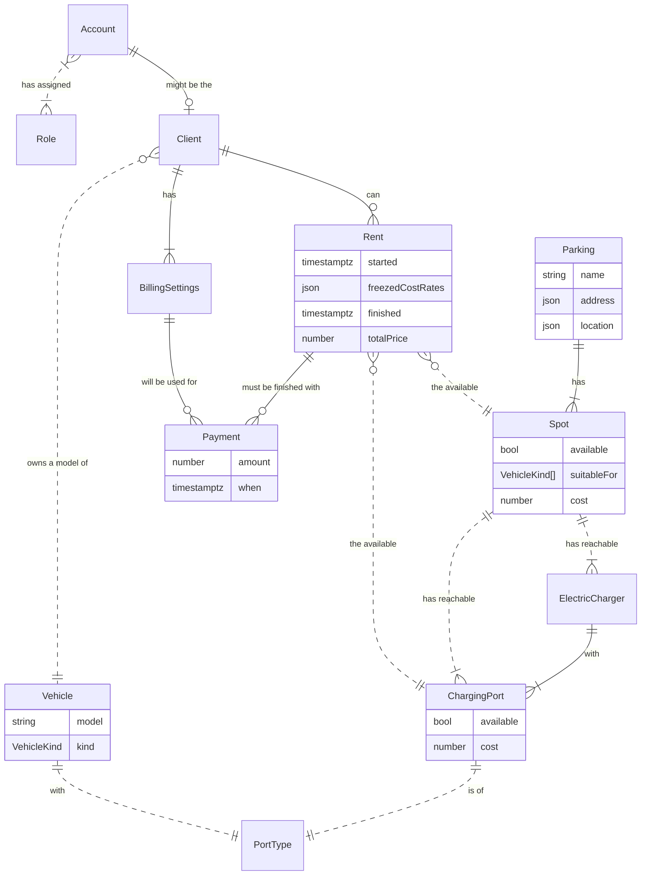

```mermaid
erDiagram
  Account }|..|{ Role : "has assigned"
  Account ||--o| Client : "might be the"
  Client ||--|{ BillingSettings : has
  Client }o..|| Vehicle : "owns a model of"
  Vehicle ||..|| PortType : with

  Rent }o..|| Spot : "the available"
  Rent }o..|| ChargingPort : "the available"
  Client ||--o{ Rent : can
  BillingSettings ||--o{ Payment : "will be used for"
  Rent ||--o{ Payment : "must be finished with"

  Parking ||--|{ Spot : has
  Spot ||..|{ ElectricCharger : "has reachable"
  Spot ||..|{ ChargingPort : "has reachable"
  ElectricCharger ||--|{ ChargingPort : with
  ChargingPort ||..|| PortType : "is of"

  Vehicle {
    string model
    VehicleKind kind
  }
  Parking {
    string name
    json address
    json location
  }
  Spot {
    bool available
    VehicleKind[] suitableFor
    number cost
  }
  ChargingPort {
    bool available
    number cost
  }
  Rent {
    timestamptz started
    json freezedCostRates
    timestamptz finished
    number totalPrice
  }
  Payment {
    number amount
    timestamptz when
  }
```
