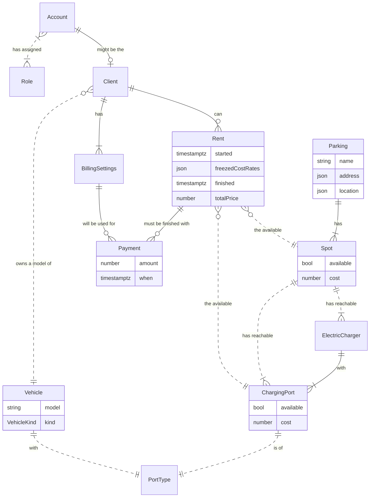
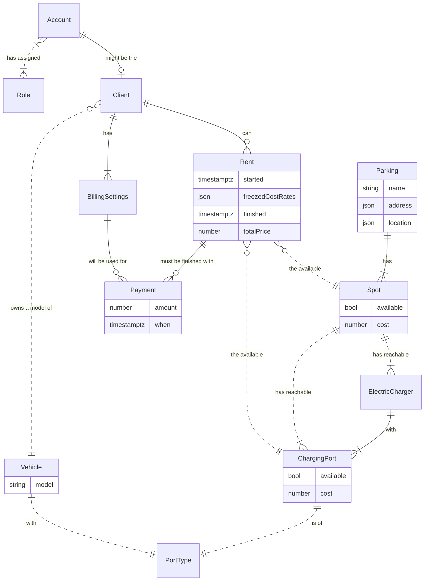
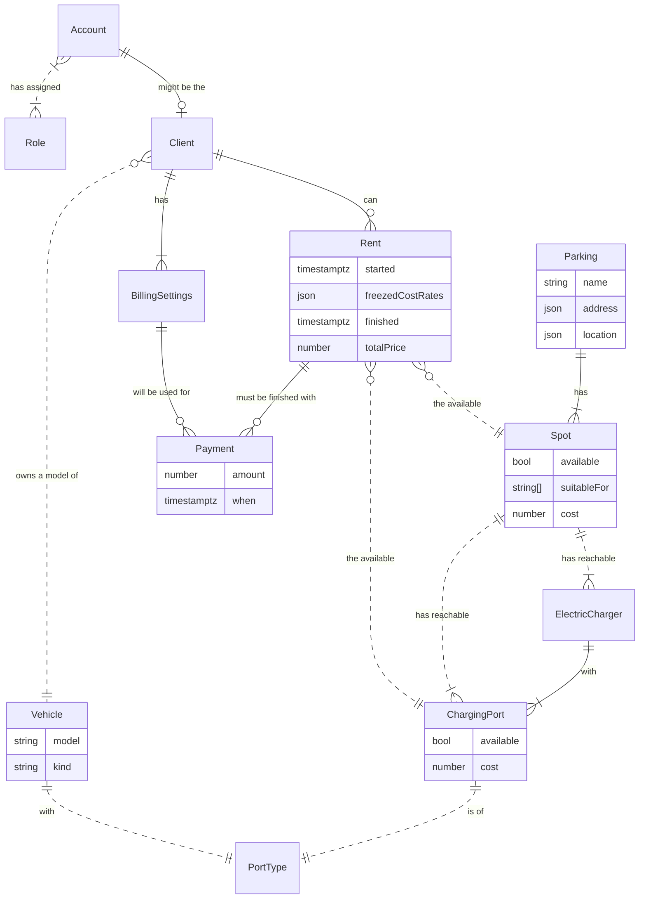
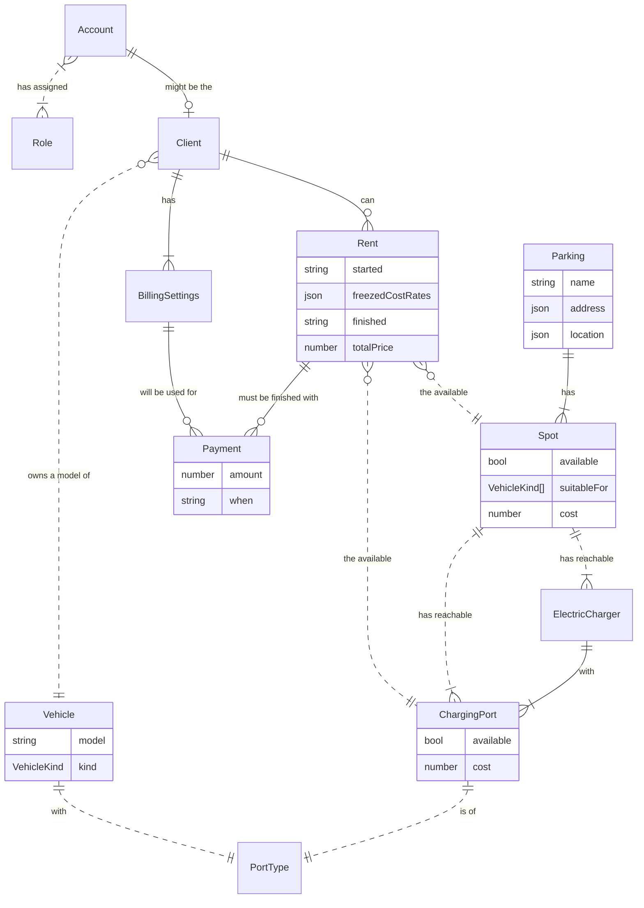
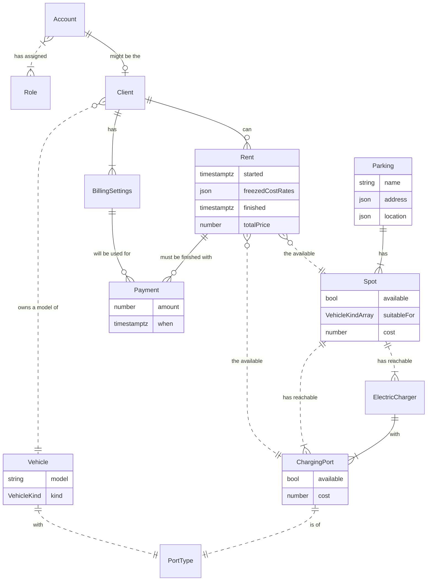

## Selected custom domain: EV Parking
Parking network for electric vehicles with warranty of available electric charger on the spot.

If the diagram not renders you may watch it on the [Mermaid.live](https://mermaid.live/edit#pako:eNp9VMuu0zAQ_RXL696qj4sQ2XELbBBS1SIWUBbTeNoYYruyHUrb9N8Z20lxH9AsqozPOTNzZuITL41AXnC07yRsLaiVZuxtWZpGe3Zuh8P2xBamRlawFa_AMXBObjWKFc-Rbfv0ZFo2qyXSW8Aqua08WyPzFSZsdxigJPoi61rq7RK9pz9HHFLPYGdDuVv2BStZdunNXlN-pqjimplNUu0BbRvxc2P958MuEPbSVwGxyOSWO5PKo6oY_AJZw7ru6stxswrsluoKcv_CZ_2YU2IXrAQdzm6760BzOKjeoD1Bgj-NQ8E2xmZFPECrxkU3N1JLVxEjdhcpc7A_KUlvbNdidLN_WIq2aZ7vayy9lWVsEu1ltBahrP72l1Pu_HiAv5Xt6rmh9lO5Ct8Pb8Wlu5vxKbww5igL9Rv3IEU6wEepBSMvRIiec2-umRoUpsAPZzQDISw6l0VqU4KXRl90ohedyNqYOtuF2wK-fWeukT6cfaCpxmPdqDU5UhrnL5JXBvxH-hE3bknH8VKh86B2_kj9gfUosk42FvGIYkbsBXh095x-o66yeeOhntMwMbMybePpCggqfP_3qvsKk3t8wBVaBVLQLRO58WOiAfAwZUEDCkMOOGi8WR50yQtvGxzwZieo5O5e6oM70Lw48d-8GD-Ph9PXb149X54BP_BidB7wozFEGA9H6TcdTcajyWgyHXAU0hv7KV168e6Lkl8jIWQ4_wGJprTW)

### Test variants of the same diagram with different detalization to find out the cause of GitHub rendering issue

Test 4: Entity Declaration first + without custom type properties

Test 5: Entity Declaration first + without property of type: `VehicleKind[]`

Test 6: Entity Declaration first + without properties of types: `VehicleKind`, `VehicleKind[]`

Test 7: Entity Declaration first + with properties of types `VehicleKind` & `VehicleKind[]` replaced by  `string` & `string[]`

Test 8: Entity Declaration first + without properties of types: `timestamptz`

Test 9: Entity Declaration first + without properties of types: `json`

Test 10 Complete and the same as original but with property type `VehicleKind[]` replaced by `VehicleKindArray`

